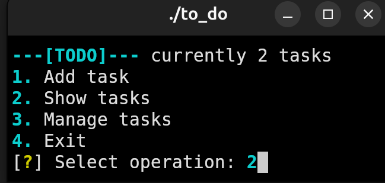
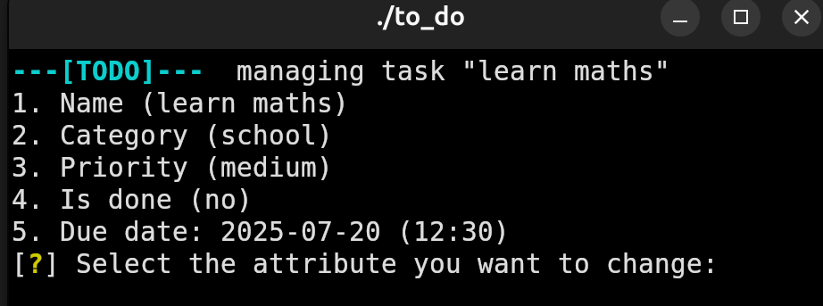
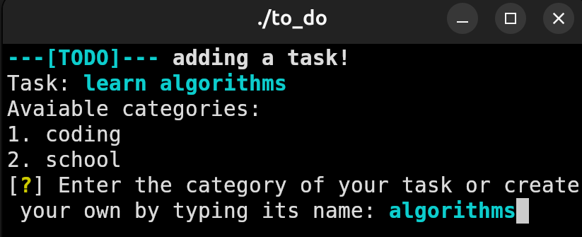
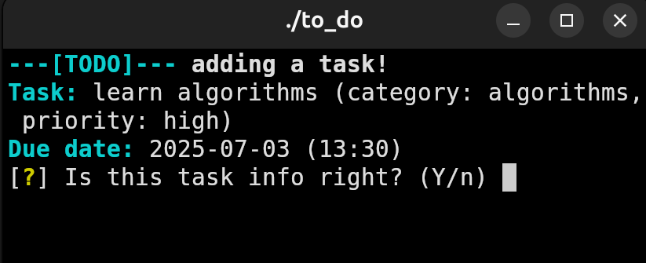
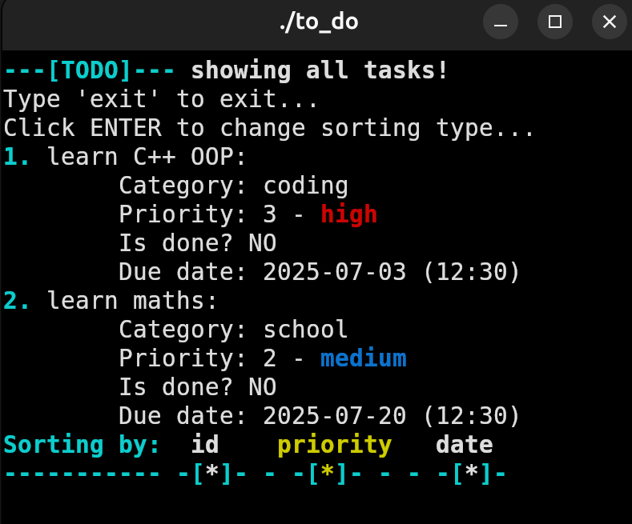

# TODO - Task manager
### 📝 Simple and quick task manager that lets you track your tasks in an easy way!
### Here are some photos of the project:

<div align="center">
  <p>Main menu:</p>
  
  
  <p>Managing tasks:</p>
  
  
  <p>Adding task:</p>
  
  
  
  <p>Show tasks:</p>
  
</div>

---

### Built and tested on Ubuntu 24.04.2 LTS

To compile and run the project, follow these steps in your terminal:


1. Create a build directory
```bash
mkdir build
cd build
```


2. Generate Makefiles with CMake
```bash
cmake ..
```
3. Compile the project
```bash
make
```
4. Run the program
```bash
./to_Do
```

### Help me grow my passion:
<p align="left">
  <a href="https://buymeacoffee.com/brtekld_prog" target="_blank">
    
  </a>
</p>

